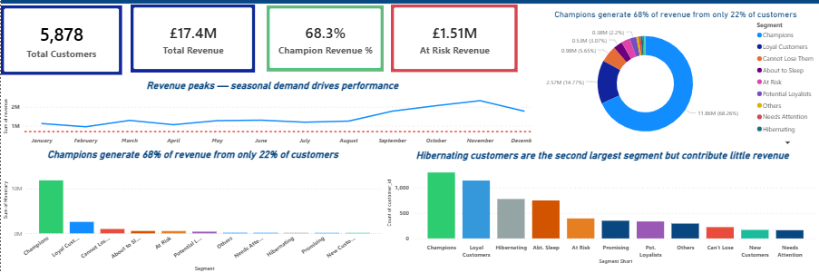
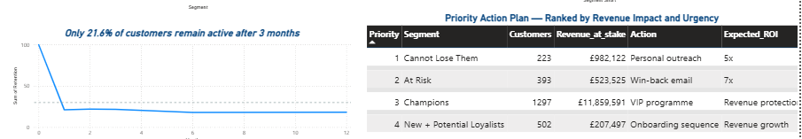

Customer Retention & RFM Analysis

Online Retail II Dataset (2009–2011) | Python • MySQL • Power BI

## Dashboard

### Overview


### RFM Segments


### Retention Analysis



Overview

This project analyzes two years of transactional data from a UK-based online retailer to uncover customer retention patterns, revenue concentration risks, and behavioral segments. Using cohort analysis and RFM (Recency, Frequency, Monetary) scoring, the project identifies which customers are most valuable, which are at risk of churning, and where targeted intervention can recover lost revenue — delivering actionable recommendations a marketing or CRM team can act on immediately.

The analysis is conducted end-to-end: from data cleaning and SQL-based exploration in MySQL, through Python-based cohort and RFM analysis, to an interactive Power BI dashboard.


Business Problem

The retailer had no structured view of customer behavior beyond raw transaction records. Without segmentation, marketing budgets were applied uniformly across all 5,878 customers — regardless of whether a customer had purchased once or fifty times. This project answers three critical business questions:


Who are our most valuable customers, and how dependent are we on them?
How quickly do new customers disengage, and when does it happen?
How much revenue is at risk right now, and what actions can recover it?


---

## Tools and Technologies

| Tool | Purpose |
| --- | --- |
| MySQL | Data exploration, business health checks, RFM queries using CTEs and window functions |
| Python (Pandas, NumPy) | Data cleaning, cohort matrix, RFM scoring, segmentation |
| Matplotlib / Seaborn | Analytical and exploratory visualizations |
| Power BI | Interactive multi-page dashboard |
| Excel / CSV | Intermediate data storage and outputs |

---

 Project Structure

```
customer-retention-rfm/
│
├── data/
│   └── processed/
│       ├── cohort_retention.csv
│       ├── customer_retail_clean.csv
│       ├── online_retail_clean.csv
│       ├── online_retail_II.csv
│       ├── recommendations.csv
│       ├── rfm_base.csv
│       ├── rfm_segments.csv
│       └── segment_summary.csv
│
├── notebooks/
│   ├── 01_Customer Retention & RFM Analysis.ipynb
│   ├── 04_rfm_calculation.ipynb
│   ├── 05_segmentation.ipynb
│   ├── 07_EDA.ipynb
│   ├── 08_cohort_analysis.ipynb
│   └── 09_insights.ipynb
│
├── sql/
│   ├── 01_exploration_queries.sql
│   └── 02_rfm_segment_analysis.sql
│
├── dashboard/
│   └── rfm_dashboard.pbix
│
├── visuals/
│   ├── dashboard_overview.png
│   ├── dashboard_rfm_segment.png
│   └── dashboard_retention.png
│
├── requirements.txt
└── README.md
...
```

## SQL Analysis

Before any Python modeling, the dataset was explored through MySQL connected via Pandas, providing a business-level understanding of the data through a SQL lens.

### Exploration Queries — 01_exploration_queries.sql

10 structured queries covering:

| Query | Business Question |
| --- | --- |
| 1 — Business Health Check | Total rows, customers, orders, revenue, and date range |
| 2 — Geographic Concentration | Which countries drive the most revenue? |
| 3 — Monthly Revenue Trend | Is growth linear or seasonal? |
| 4 — High-Value Customers | Who are the top 20 customers by revenue? |
| 5 — Order Frequency Distribution | How many customers are one-time vs repeat buyers? |
| 6 — Customer Lifecycle Length | How long do repeat customers stay active? |
| 7 — Country Revenue with Window Functions | Revenue share per country using SUM() OVER() |
| 8 — At-Risk High-Value Customers | Which previously valuable customers have gone inactive? |
| 9 — Repeat vs One-Time Revenue Split | What percentage of revenue comes from repeat buyers? |
| 10 — Pareto Validation | Do the top 20% of customers generate 80% of revenue? |

### RFM Segment Analysis — 02_rfm_segment_analysis.sql

Advanced SQL on the scored RFM table using CTEs, window functions, NTILE(), LAG(), CASE WHEN, and multi-table JOINs:

| Query | Business Question |
| --- | --- |
| 1 — Segment Overview | Full metrics per segment with revenue percentage share |
| 2 — Revenue Concentration Risk | How dangerous is our dependency on Champions? |
| 3 — At-Risk Revenue Exposure | How much revenue is at risk by priority tier? |
| 4 — Champion Deep Dive | Who exactly are the top 20 Champion customers? |
| 5 — Frequency by Segment | Do segments show meaningfully different purchasing behaviour? |
| 6 — Recency by Segment | How inactive are At Risk vs active segments? |
| 7 — Pareto Validation | Does the business confirm the 80/20 rule? |
| 8 — Month-over-Month Revenue | Is revenue growing or declining using LAG()? |
| 9 — Segment Revenue by Country | Are high-value segments geographically concentrated? |
| 10 — Win-Back Candidate List | Prioritized CRM action list with recommended offers |

---

## Key Findings

**1. Severe Revenue Concentration Risk**

Only 22.1% of customers (1,297 Champions) generate 68.3% of total revenue (£11.86M). Pareto validation confirms the top 20% of customers account for 77.2% of revenue — meaning the business is critically exposed if even a small number of Champions churn.

**2. Retention Drops Sharply After Acquisition**

Cohort analysis reveals that only 21.6% of customers remain active after 3 months. The December 2009 cohort — acquired during the UK festive season — was the strongest performer, with 35.3% Month 1 retention and engagement peaking at 49.5% by Month 10. Cohorts from 2010 onwards showed significantly weaker early retention (15–25%).

**3. £1.5M in Immediately Recoverable Revenue**

Two segments represent high-value churn risk requiring urgent CRM action:

- Cannot Lose Them: 223 customers, £982K revenue — inactive for an average of 342 days
- At Risk: 393 customers, £524K revenue — inactive for an average of 369 days

Combined, £1.5M in revenue is recoverable through targeted win-back campaigns.

**4. Repeat Buyers Drive 96.8% of Revenue**

SQL analysis confirmed that 4,255 repeat buyers generate £16.81M (96.8%) of total revenue, while 1,623 one-time buyers contribute only £560K (3.2%). Converting one-time buyers into repeat buyers is the highest-leverage growth opportunity.

**5. Geographic Over-Dependence on UK**

5,350 of 5,878 customers (82.8%) are UK-based, with an average revenue per UK customer of £2,689.58. International markets remain underdeveloped, creating both a concentration risk and a diversification opportunity.

---

## RFM Segment Breakdown

| Segment | Customers | Revenue | % of Total Revenue |
| --- | --- | --- | --- |
| Champions | 1,297 | £11.86M | 68.3% |
| Loyal Customers | 1,138 | £2.57M | 14.8% |
| Cannot Lose Them | 223 | £982K | 5.7% |
| About to Sleep | 747 | £533K | 3.1% |
| At Risk | 393 | £524K | 3.0% |
| Potential Loyalists | 334 | £383K | 2.2% |
| Others | 292 | £134K | 0.8% |
| Need Attention | 162 | £123K | 0.7% |
| Hibernating | 776 | £121K | 0.7% |
| Promising | 348 | £93K | 0.5% |
| New Customers | 168 | £56K | 0.3% |
| **Total** | **5,878** | **£17.33M** | **100%** |

---

## Business Recommendations

| Priority | Segment | Action | Expected Impact |
| --- | --- | --- | --- |
| Critical | Cannot Lose Them (223) | Personal outreach this week, 20% loyalty credit | Protect £982K revenue |
| Critical | At Risk — high value | Personalised win-back, 15% discount | Recover up to £524K |
| High | About to Sleep (747) | Automated email re-engagement within 30 days | Retain £533K before full churn |
| Growth | Potential Loyalists (334) | Loyalty programme enrolment, upsell campaigns | Pipeline to £2.57M Loyal tier |
| Growth | New Customers (168) | Structured 90-day onboarding journey | Improve 21.6% three-month retention rate |


## How to Run

1. Clone this repository

```
git clone https://github.com/fiza520/customer-retention-rfm-analysis.git
```

2. Install Python dependencies

```
pip install -r requirements.txt
```

3. Set up MySQL — create a database called customer_retention and run the two SQL files in the sql/ folder in order.


Run notebooks in order


-  01_Customer Retention & RFM Analysis.ipynb
-  04_rfm_calculation.ipynb
-  05_segmentation.ipynb
- 07_EDA.ipynb
- 08_cohort_analysis.ipynb
- 09_insights.ipynb
  
4. Open dashboard/rfm_dashboard.pbix in Power BI Desktop

---

## Data Source

[Online Retail II Dataset](https://archive.ics.uci.edu/ml/datasets/Online+Retail+II) — UCI Machine Learning Repository

Transactions from a UK-based non-store online retailer between December 2009 and December 2011, containing 1M+ invoice records across 40+ countries.

---

## Author

**Fiza** — Aspiring Data Analyst   
[GitHub Profile](https://github.com/fiza520)

---

*This project demonstrates end-to-end analytical capability — from raw data cleaning and SQL exploration through Python-based modelling to business-ready insights and interactive dashboarding.*
