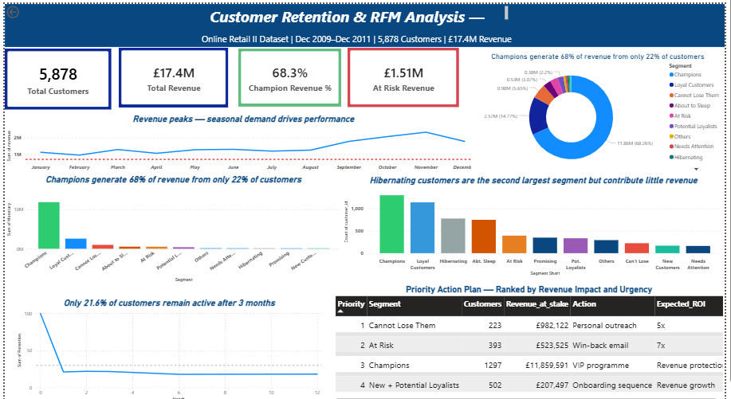

Customer Retention & RFM Analysis

Online Retail II Dataset (2009–2011) | Python • MySQL • Power BI

## Dashboard

### Overview


### RFM Segments


### Retention Analysis


Overview

This project analyzes two years of transactional data from a UK-based online retailer to uncover customer retention patterns, revenue concentration risks, and behavioral segments. Using cohort analysis and RFM (Recency, Frequency, Monetary) scoring, the project identifies which customers are most valuable, which are at risk of churning, and where targeted intervention can recover lost revenue — delivering actionable recommendations a marketing or CRM team can act on immediately.

The analysis is conducted end-to-end: from data cleaning and SQL-based exploration in MySQL, through Python-based cohort and RFM analysis, to an interactive Power BI dashboard.


Business Problem

The retailer had no structured view of customer behavior beyond raw transaction records. Without segmentation, marketing budgets were applied uniformly across all 5,878 customers — regardless of whether a customer had purchased once or fifty times. This project answers three critical business questions:


Who are our most valuable customers, and how dependent are we on them?
How quickly do new customers disengage, and when does it happen?
How much revenue is at risk right now, and what actions can recover it?


## Tools and Technologies

(BLANK LINE)
| Tool | Purpose |
| --- | --- |
| MySQL | Data exploration, business health checks, RFM queries using CTEs and window functions |
| Python (Pandas, NumPy) | Data cleaning, cohort matrix, RFM scoring, segmentation |
| Matplotlib / Seaborn | Analytical and exploratory visualizations |
| Power BI | Interactive multi-page dashboard |
| Excel / CSV | Intermediate data storage and outputs |
(BLANK LINE)

 Project Structure

```
customer-retention-rfm/
│
├── data/
│   └── processed/
│       ├── cohort_retention.csv
│       ├── customer_retail_clean.csv
│       ├── online_retail_clean.csv
│       ├── online_retail_II.csv
│       ├── recommendations.csv
│       ├── rfm_base.csv
│       ├── rfm_segments.csv
│       └── segment_summary.csv
│
├── notebooks/
│   ├── 01_Customer Retention & RFM Analysis.ipynb
│   ├── 04_rfm_calculation.ipynb
│   ├── 05_segmentation.ipynb
│   ├── 07_EDA.ipynb
│   ├── 08_cohort_analysis.ipynb
│   └── 09_insights.ipynb
│
├── sql/
│   ├── 01_exploration_queries.sql
│   └── 02_rfm_segment_analysis.sql
│
├── dashboard/
│   └── rfm_dashboard.pbix
│
├── visuals/
│   ├── dashboard_overview.png
│   ├── dashboard_rfm_segment.png
│   └── dashboard_retention.png
│
├── requirements.txt
└── README.md
...
```

SQL Analysis

Before any Python modeling, the dataset was explored through MySQL connected via Pandas, providing a business-level understanding of the data through a SQL lens.

Exploration Queries (01_exploration_queries.sql)

10 structured queries covering:

QueryBusiness Question1 — Business Health CheckTotal rows, customers, orders, revenue, and date range2 — Geographic ConcentrationWhich countries drive the most revenue?3 — Monthly Revenue TrendIs growth linear or seasonal?4 — High-Value CustomersWho are the top 20 customers by revenue?5 — Order Frequency DistributionHow many customers are one-time vs repeat buyers?6 — Customer Lifecycle LengthHow long do repeat customers stay active?7 — Country Revenue with Window FunctionsRevenue share % per country using SUM() OVER()8 — At-Risk High-Value CustomersWhich previously valuable customers have gone inactive?9 — Repeat vs One-Time Revenue SplitWhat % of revenue comes from repeat buyers?10 — Pareto ValidationDo top 20% of customers generate 80% of revenue?

RFM Segment Analysis (02_rfm_segment_analysis.sql)

Advanced SQL applied to the scored RFM table using CTEs, window functions, NTILE(), LAG(), CASE WHEN, and multi-table JOINs:

QueryBusiness Question1 — Segment OverviewFull metrics per segment with revenue % share2 — Revenue Concentration RiskHow dangerous is Champions dependency?3 — At-Risk Revenue ExposureHow much revenue is actively at risk by priority tier?4 — Champion Deep DiveWho exactly are the top 20 Champion customers?5 — Frequency by SegmentDo segments show meaningfully different purchasing behaviour?6 — Recency by SegmentHow inactive are At Risk vs active segments?7 — Pareto ValidationDoes the business confirm the 80/20 rule?8 — Month-over-Month RevenueIs revenue growing or declining using LAG()?9 — Segment Revenue by CountryAre high-value segments geographically concentrated?10 — Win-Back Candidate ListPrioritized CRM action list with recommended offers


Key Findings

1. Severe Revenue Concentration Risk

Only 22.1% of customers (1,297 Champions) generate 68.3% of total revenue (£11.86M). Pareto validation confirms the top 20% of customers account for 77.2% of revenue — meaning the business is critically exposed to champion-level churn.

2. Retention Drops Sharply After Acquisition

Cohort analysis reveals that only 21.6% of customers remain active after 3 months. The December 2009 cohort — acquired during the UK festive season — was the strongest performer, with 35.3% Month 1 retention and engagement peaking at 49.5% by Month 10. Cohorts acquired from 2010 onwards showed significantly weaker early retention (15–25%), suggesting acquisition quality declined outside the holiday season.

3. £1.5M in Immediately Recoverable Revenue

Two segments represent high-value churn risk requiring urgent CRM action:


Cannot Lose Them: 223 customers, £982K revenue — inactive for an average of 342 days
At Risk: 393 customers, £524K revenue — inactive for an average of 369 days


Combined, £1.5M in revenue is recoverable through targeted win-back campaigns before these customers are permanently lost.

4. Repeat Buyers Drive 96.8% of Revenue

SQL analysis confirmed that 4,255 repeat buyers generate £16.81M (96.8%) of total revenue, while 1,623 one-time buyers contribute only £560K (3.2%). Improving even the earliest stage of the customer journey — converting one-time buyers into repeat buyers — represents the highest-leverage growth opportunity.

5. Geographic Over-Dependence on UK

5,350 of 5,878 customers (82.8%) are UK-based, with an average revenue per UK customer of £2,689.58. International markets remain underdeveloped, creating both a concentration risk and a diversification opportunity.


RFM Segment Breakdown

SegmentCustomersRevenue% of Total RevenueChampions1,297£11.86M68.3%Loyal Customers1,138£2.57M14.8%Cannot Lose Them223£982K5.7%About to Sleep747£533K3.1%At Risk393£524K3.0%Potential Loyalists334£383K2.2%Others292£134K0.8%Need Attention162£123K0.7%Hibernating776£121K0.7%Promising348£93K0.5%New Customers168£56K0.3%Total5,878£17.33M100%


Business Recommendations

Priority Segmen tAction Expected Impact
🔴 CriticalCannot Lose Them (223)Personal outreach this week, 20% loyalty credit Protect £982K revenue
🔴 CriticalAt Risk — high value Personalised win-back, 15% discountRecover up to £524K
🟡 High About to Sleep (747)Automated email re-engagement within 30 daysRetain £533K before full churn
🟢 Growth Potential Loyalists (334)Loyalty programme enrolment, upsell campaignsPipeline to £2.57M Loyal tier
🟢 Growth New Customers (168)Structured 90-day onboarding journeyImprove 21.6% three-month retention rate


Dashboard

Overview

Show Image

RFM Segments

Show Image

Retention Analysis

Show Image


How to Run


Clone this repository


bash   git clone https://github.com/fiza520/customer-retention-rfm-analysis.git


Install Python dependencies


bash   pip install -r requirements.txt


Set up MySQL

Create a database: CREATE DATABASE customer_retention;
Run sql/01_exploration_queries.sql on your cleaned orders table
Run sql/02_rfm_segment_analysis.sql after RFM scoring is complete


Run notebooks in order


   01_data_cleaning.ipynb
   02_cohort_analysis.ipynb
   03_rfm_analysis.ipynb
   04_insights.ipynb


Open the dashboard

Open dashboard/rfm_dashboard.pbix in Power BI Desktop


Data Source

Online Retail II Dataset — UCI Machine Learning Repository

Transactions from a UK-based non-store online retailer between December 2009 and December 2011, containing 1M+ invoice records across 40+ countries.


Author

Fiza — Aspiring Data Analyst
📍 Raipur, India
🔗 GitHub


This project was built as part of a structured data analytics portfolio to demonstrate end-to-end analytical capability — from raw data cleaning and SQL exploration through Python-based modelling to business-ready insights and interactive dashboarding.
